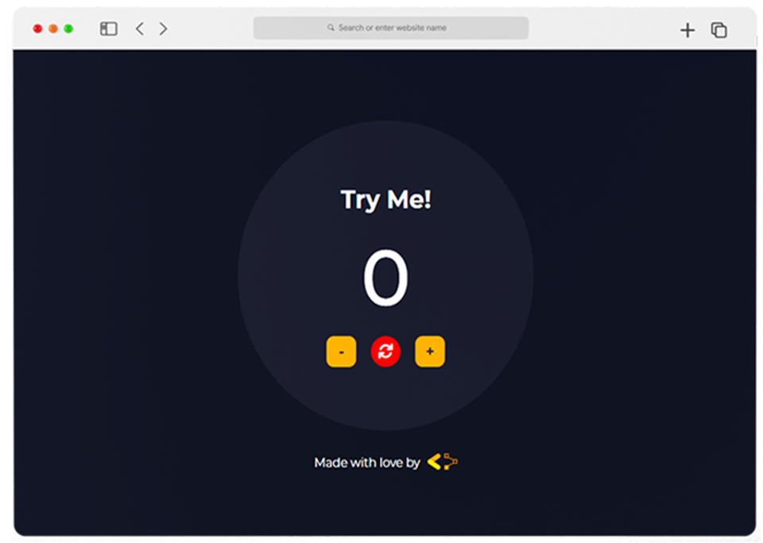

<a name="readme-top"></a>

<!-- LOGO -->
<div align="center">
  

  <h1 align="center">COUNTER</h1>

  <p align="center">
    Progetto per il corso base di Javascript di Start2Impact
    <br />
    <a href="https://github.com/othneildrew/Best-README-Template"><strong>View Project</strong></a>
    <br />
  </p>
</div>

<!-- ABOUT THE PROJECT -->
## Introduzione

<div align="center">
  
</div>

Per il corso base di Javascript, ho realizzato un semplice contatore (counter) con le seguenti funzionalità

* Possibilità di aggiungere e rimuovere unità al contatore tramite l'ausilio di due pulsanti.
* Possibilità di resettare il contatore al valore di partenza (0).
* Tutto il codice, incluso quello di generazione dell'HTML, è stato realizzato in Javascript.

<p align="right">(<a href="#readme-top">back to top</a>)</p>


### Tecnologie Impiegate

Per la realizzazione del progetto sono state impiegate le seguenti tecnologie:

<p float="left">
  
   
  
</p>

<p align="right">(<a href="#readme-top">back to top</a>)</p>


<!-- USAGE EXAMPLES -->
## Specifiche Tecniche

Il progetto è stato realizzato interamente con l'utilizzo di Javascript.

Le uniche eccezioni sono gli stili CSS (style.css) e la pagina HTML (index.html) che contiene solo la struttura base per HEAD e BODY, nonchè le importazioni necessarie a far funzionare il progetto.

Da notare che il javascript è stato importato nell'HEAD della pagina, e non prima della chiusura del tag **BODY** come di consueto, con l'aggiunta dell'attributo `defer`, pratica che permette di caricare il javascript immediatamente, ma differire la sua esecuzione una volta pronto il DOM.

Nello specifico, nel file counter.js è possibile osservare la seguente struttura:

* All'inizio del file è possibile trovare le dichiarazioni ed inizializzazioni delle variabili `counterValue` (utilizzata per tenere traccia del contatore) e `body` (utilizzata per avere un riferimento al tag **BODY** nella pagina HTML)
* Subito dopo sono presenti i richiami alle funzioni `createCounter()` e `createSign()`.
* La prima funzione (`createCounter()`) ha lo scopo di creare e dare funzionalità a tutti gli elementi che compongono il contatore effettivo. 
* La seconda funzione (`createSign()`) ha invece lo scopo di creare gli elementi che compongono la firma.

Di particolare importanza è la funzione `createCustomElement()`. Poichè gran parte degli elementi condivideva lo stesso codice, ovvero:

```javascript
let htmlElement = document.createElement(<tipo>);
htmlElement.innerHTML = <valore>;
htmlElement.classList.add(<classe>);
htmlContainer.appendChild(htmlElement)
```

si è preferito "esternalizzare" l'operazione in una funzione, quanto più generalizzata possibile, che potesse essere richiamata all'occorrenza senza dover ripetere lo stesso codice più volte.

<p align="right">(<a href="#readme-top">back to top</a>)</p>


<!-- CONTATTI -->
## Contact

Valentina Bulian

[Github](https://github.com/ValentinaBoolean)

[Project Repository](https://github.com/ValentinaBoolean/Counter)

[Project Url]()

<p align="right">(<a href="#readme-top">back to top</a>)</p>
